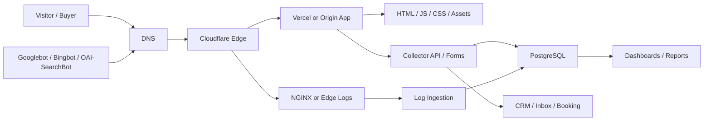
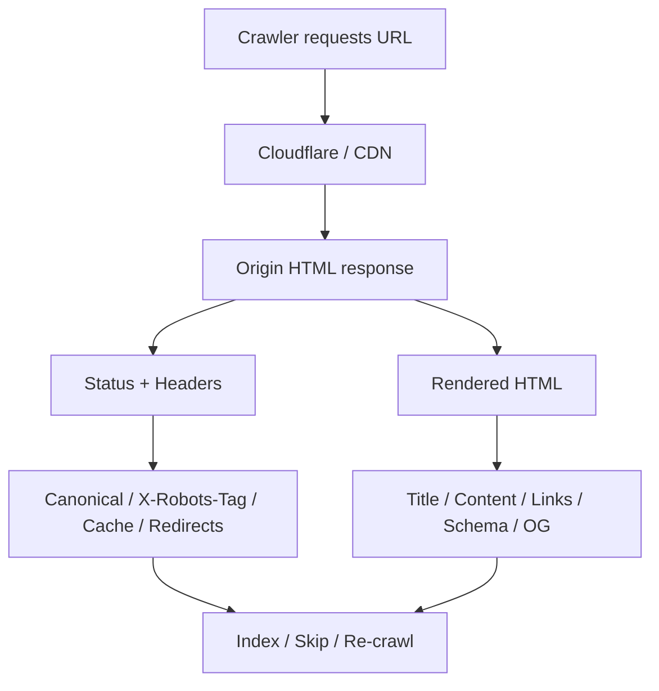
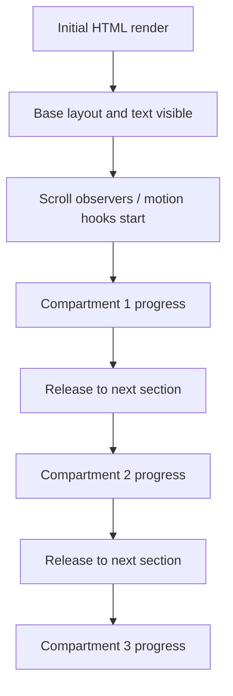
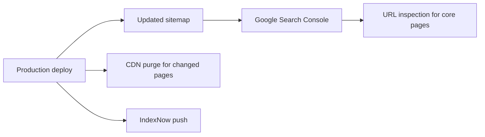
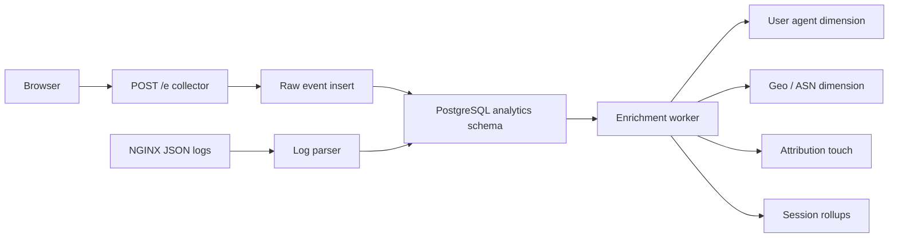
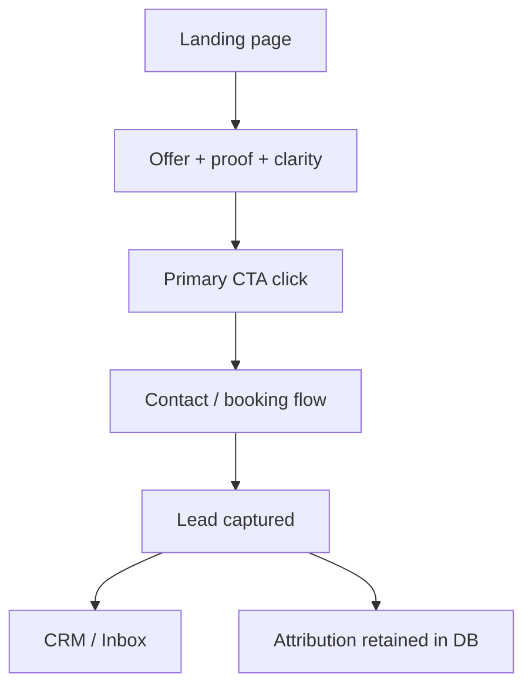

# Technical Architecture Deep Dive

Prepared: March 26, 2026

## Goal
This document maps the full technical system behind a high-performing DotsAI marketing site so development, deployment, analytics, and SEO all support the same business outcome:

- maximum qualified traffic
- clean indexing
- strong crawl freshness
- fast rendering
- reliable conversion capture
- measurable attribution

## System view



## Three parallel systems

The website is not one system. It is three systems running at once:

### 1. Crawl and indexing system
This decides whether search engines can:
- fetch the site
- render the site
- understand the site
- trust the canonical URLs
- revisit the site efficiently

### 2. User experience and conversion system
This decides whether human visitors:
- understand the offer quickly
- trust the founder and business
- navigate the compartments smoothly
- take the primary CTA
- successfully submit intent

### 3. Measurement and attribution system
This decides whether DotsAI can:
- know where traffic came from
- measure which landing pages work
- connect sessions to leads
- debug technical regressions quickly

If one of these systems fails, growth gets capped.

## Crawl and indexing flow



## Critical crawl-layer controls

### DNS and hostname controls
- apex domain resolves correctly
- `www` behavior is deliberate
- old domains redirect in one hop
- staging domains are not publicly indexable

### CDN and edge controls
- no challenge page for legitimate crawlers
- no injected `X-Robots-Tag: noindex`
- no stale cached canonical or robots output
- cache purge on deploy for changed money pages

### origin controls
- correct HTTP status code
- canonical points to final public URL
- HTML contains meaningful content even before client-side enhancement
- soft navigations in SPA still expose crawlable content on route URLs

## Platform-specific risk map

### Vercel risks
- preview deployments are intentionally non-indexed
- production can be accidentally protected by Deployment Protection
- environment-based robots logic can leak `noindex` into production
- rewrites can produce clean-looking pages with incorrect canonical/source behavior

### Cloudflare risks
- WAF or bot rules can challenge crawlers
- Transform Rules or Workers can alter headers unexpectedly
- stale edge cache can keep old canonicals or old robots output
- cache rules can incorrectly normalize query strings or HTML variants

### app-level risks
- route not found pages return `200`
- client-only rendering hides content from fetch/render stages
- metadata generated from the wrong base URL
- sitemap generator still points to a previous domain

## Canonical control plane

Every one of these must agree on the same URL base:

- canonical tag
- Open Graph URL
- Twitter canonical URL if set
- sitemap entries
- structured data `url`
- internal absolute links
- hreflang if used
- redirects

For DotsAI, the only acceptable public canonical base is:
- `https://dotsai.in/...`

## URL strategy

Use:
- homepage for brand and conversion
- subfolder pages for commercial intent
- proof pages for trust and citations
- insight pages for long-tail expansion

Recommended root structure:

```text
/
/ai-agency-india
/private-ai
/ai-automation
/platform-engineering
/web-ai-experiences
/case-studies
/insights
/contact
```

Do not start with service subdomains. They split authority too early.

## Rendering model

The ideal model for this revamp is:
- server-rendered or statically rendered HTML for key sections
- client enhancement for motion and compartment scrolling
- progressive enhancement for animation

That means:
- the page is meaningful before scroll effects initialize
- text and CTA are visible without waiting for heavy JS
- reduced-motion users still get the full content
- crawlers do not depend on scroll logic to discover content

## Scroll-compartment implementation model



Engineering rules:
- content order must make sense without animation
- use transform/opacity where possible
- avoid layout thrash in scroll handlers
- keep each compartment bounded and test on low-end mobile
- do not trap the user in fake-scroll experiences

## Asset and performance model

Critical rendering path should include only:
- minimal HTML
- critical CSS
- one primary webfont strategy
- lightweight hero media

Avoid:
- multiple decorative font families at launch
- huge hero videos above the fold
- unbounded animation libraries
- multiple third-party scripts competing on initial load

## Structured data model

At minimum:
- `Organization`
- `WebSite`
- `BreadcrumbList`
- `LocalBusiness` if local intent matters and business details are real

Optional, only if true:
- `Service`
- `Article`
- `FAQPage`

Do not add schema that the visible page does not support.

## Search console and submission model



Operational rule:
- any major homepage or service-page release should be followed by:
  - sitemap validation
  - URL inspection request for the changed key pages
  - cache purge if HTML was cached at the edge

## Analytics system architecture



## Analytics data model

### Acquisition
- `attribution_touches`
- referrer domain
- UTM dimensions
- click IDs

### Behavior
- `pageviews`
- `events`
- section engagement
- CTA clicks
- form starts and submits

### Quality
- `web_vitals`
- `js_errors`
- `request_logs`

### Identity
- anonymous `visitors`
- `sessions`
- optional `crm.contact_identities` after explicit action

## Conversion path



A growth site fails if any part of this chain breaks silently.

## Failure map

### Rankings can fail because
- wrong canonical domain
- soft 404s
- production `noindex`
- blocked crawlers
- thin service pages
- poor internal linking
- weak entity consistency

### Traffic can fail because
- weak titles and snippets
- low query-page fit
- poor mobile speed
- weak proof and trust
- inadequate local/business signals

### Conversions can fail because
- hero is impressive but unclear
- CTA hierarchy is messy
- form is too long or fragile
- proof is vague
- follow-up path is broken

### Analytics can fail because
- ad click IDs are dropped
- direct/referral/source logic is inconsistent
- sessions split too aggressively
- logs are not scrubbed or not queryable
- lead stitching is missing

## Technical release priorities for DotsAI

### P0 before design polish
- canonical domain correction
- real 404 behavior
- sitemap correction
- production header verification
- crawlable service-page architecture
- form and attribution reliability

### P1 before growth scaling
- Search Console and Bing setup
- Cloudflare and Vercel indexing checks
- structured data validation
- edge log ingestion
- event and conversion dashboards

### P2 after launch
- Crawler Hints / IndexNow tuning
- richer proof content clusters
- optional replay with masking
- anomaly detection and alerting

## Build rule
Treat the revamp as an integrated system. Do not separate design, SEO, edge config, and analytics into different phases so completely that they only meet at launch. That is how premium-looking sites end up invisible or unmeasurable.
